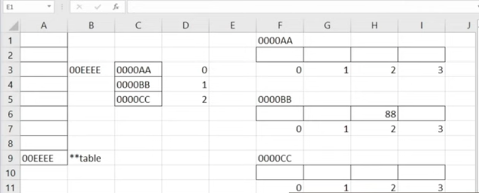

# C++ Pointers

## Introduction to C++ Pointers
```cpp
#include <iostream>
using namespace std;

int main(){
    int n = 5;
    cout << &n << endl; // returns address of variable in memory

    // to create a pointer
    // declare data type and assign it to address of variable
    int* ptr = &n;
    cout << ptr << endl;
    // to access value stored in address, you must dereference
    cout << *ptr << endl;
    // to reassign,
    *ptr = 10; // changes value in memory location address
    cout << *ptr << endl; //10
    cout << *n << endl; //10

    int v; // give address to v;
    int *ptr2 = &v; // pointer must be assigned to a declared variable. Must have an address
    *ptr2 = 7;
    cout << *v << endl; //7
    
    system("pause>0");
    return 0;
}
```

## What is a void pointer?
- `Void pointer` a special type of pointer that can hold the address of a variable of any other data type. i.e void pointer can hold the address of a float variable or an int variable.
- Limit is you cannot directly dereference a void pointer

```cpp
#include <iostream>
using namespace std;

void printNumber(int* numberPtr){
    cout << *numberPtr << endl;
}

void printNumber(char* charPtr){
    cout << *charPtr << endl;
}

void print(void* ptr, char type){
    switch(type){
        case 'i': cout << *((int*)ptr) << endl; break; // cast it 
        case 'c': cout << *((char*)ptr) << endl; break;
    }
}

int main(){
    int number = 5;
    char letter = 'a';
    // printNumber(&number);
    // printChar(&letter);
    print(&number, 'i');
    print(&letter, 'c');

    system("pause>0");
    return 0;
}
```

## How to use Pointers and Arrays
- printing the array yields the address of the first element in the array

```cpp
#include <iostream>
using namespace std;

int main(){
    int luckyNumbers[5];
    for(int i = 0; i <=4; i++){
        cout << "Number: ";
        cin >> luckyNumbers[i];
    }

    for(int i = 0; i <=4; i++){
        // if you try to iterate and access an element outside, it could reference another memory location space. for example. changing i limit to 5;
        cout << *(luckyNumbers+i) << " "; // another of accessing elements using deferencing
    }
}
```

## Return Multiple values from a Function using Pointers
- How to use pointers to return multiple values from function
```cpp
#include <iostream>
using namespace std;

int getMin(int numbers[], int size){
    int min = numbers[0];

    for(int i = 1; i < size; i++){
        if(numbers[i] < min)
            min = numbers[i];
    }
    return min;
}

int getMax(int numbers[], int size){
    int max = numbers[0];

    for(int i = 1; i < size; i++){
        if(numbers[i] > max)
            max = numbers[i];
    }
    return max;
}

void getMinandMax(int numbers[], int size, int*min, int*max){ // pointer to min and max
    for(int i = 1; i < size; i++){
        if(numbers[i] > *max) //dereference max
            *max = numbers[i];
        if(numbers[i] > *min) //dereference min
            *min = numbers[i];
    }
}

int main(){
    int numbers[5]={5,4,-2,29,6};
    // cout << "Min is " << getMin(numbers,5) << endl;
    // cout << "Min is " << getMax(numbers,5) << endl;
    int min = numbers[0];
    int max = numbers[0];
    getMinandMax(numbers,5,&min,&max); //address of min and max, passing a parameter using a reference => pass an address of a var to function rather than 
    // passing value because if address is not passed, function is going to create a copy and whatever changes will only appear on that copy
    system("pause>0");
    return 0;
}
```

## Dynamic Arrays - How to change/create arrays at runtime
- size of array has to be known at compile time
- allocate/deallocate memory => new/delete
- every time you allocate new memmory, must deallocate
```cpp
#include <iostream>
using namespace std;

int main(){
    int size;
    cout << "Size: ";
    cin >> size;
    // int myArray[size];
    int * myArray = new int [size]; // allocate memory

    for(int i = 0; i <<size; i++){
        cout << "Array[" << i << "] ";
        cin >> myArray[i];
    }

    for(int i = 0; i <<size; i++){
        cout << myArray[i] << " ";
    }

    delete[]myArray; // deallocate memory
    myArray = NULL; // array will not point to address
}
```

## Multidimensional dynamic arrays (two-dimensional dynamic array)
- Multidimension is array of arrays


```cpp
#include <iostream>
using namespace std;

int main(){
    int rows, cols;

    cout << "rows , cols";
    cin >> rows >> cols;

    // pointer to a pointer , integer array of pointers
    int **table = new int*[rows];

    for(int i = 0; i < rows; i++){
        table[i] = new int[cols];
    }

    table[1][2] = 88;

    // deallocate array
    for(int i = 0; i < rows; i++){
        delete[] table[i] 
    }

    delete[] table;

    table = NULL;

    system("pause>0");
    return 0;
}
```

## How to Detect Errors and Bugs in Code?
- `PVS-Studio` is an app you can install from Visual Studio a tool for detecting bugs and security weakneses in the source code.
```cpp
#include <iostream>
using namespace std;

int main(){

    int savedMoney[5] = {100,200,300,400,500};

    int total = 0;

    for(int i = 0; i<=5; i++){
        total += savedMoney[i];
    }

    cout << "Total: " << total;

    system("pause>0");
    return 0;
}
```

## Explaining Memory Leaks in C

```cpp
#include <iostream>
using namespace std;

void myFunction(){
    // will lose access to pointer once function ends
    int *ptr= new int[5];
    ptr[2] = 10;
    cout << "Hi, I am = " << ptr[2];
    // if not deallocated, leaking memory
    delete [] ptr;
}

int main(){

    myFunction();

    system("pause>0");
    return 0;
}
```

## Function Pointers
- `functoin pointers`, instead of storing address of variable, it stores the address of a function
- why use them? to be able to pass a function as a parameter or arg to another function
```cpp
#include <iostream>
using namespace std;

// int getNumber(){
//     return 5;
// }

int add(int a, int b){
    return a + b;
}

int main(){

    // cout << getNumber; //returns address
    // function pointer
    // int(*funcPtr)(); = getNumber; // created function pointer that doesn't pass paraneter
    // cout << funcPtr();

    int(*funcPtr)(int,int) = add;
    cout << add(2,3) << endl;
    cout << funcPtr(3,4) << endl;

    system("pause>0");
    return 0;
}
```

## Smart Pointers (unique, shared, weak)
- `Smart pointer` is a container or a wrapper for a raw pointer. advatage is they deallocate memory automatically, meaning avoiding potential memory leaks.
- first thing is to include `memory`

```cpp
#include <iostream>
#include <memory>
using namespace std;

class MyClass {
    public:
        // constructor
        MyClass(){
            cout<< "Contructor invoked" << endl;
        }
        // destructor, invoked at the end of life of that object
        ~MyClass(){
            cout << "Desctructor invoked" << endl;
        }
}

int main(){
    // UNIQUE
    // specify type, name of pointer, make_unique method for creating unique pointer, store value of 25 at that address.
    unique_ptr<int>unPtr1=make_unique<int>(25);
    cout << unPtr1 << endl; // address
    // to dereference a smart pointer, use asterisk symbol
    cout << *unPtr1 << endl; // 25

    unique_ptr<int>unPtr2 = move(unPtr1); // method to transfer memory address. unPtr1 is null and empty now, cannot dereference

    // scope
    { // constructor invoked
        unique_ptr<MyClass>unPtr1 = make_unique<MyClass>();
    } // destructor invoked
    

    // SHARED
    // shared pointer can be shared. unlikke unique pointer, shared can be shared between multiple owners, one raw pointer to multiple
    {
        shared_ptr<MyClass>shPtr1=make_shared<MyClass>();
        cout << "Shared count: " << shPtr1.useCount() << endl; // 1 only 1 pointing to it
        shared_ptr<MyClass>shPtr2= shPtr1;
        {
            cout << "Shared count: " << shPtr1.useCount() << endl; // 2
        }
        // memory will be deallocated when there are no more pointers pointing to that memory location
    }

    // WEAK 
    // difference between a weak pointer and a shared is its used to observe objects in memory but a weak pointer will not keep that object alive
    // used to locate a specific object in memory but a weak pointer will not keep that object alive if nothing else needs it whereas a shared pointer will that alive

    weak_ptr<int> wePtr1;
    {
        shared_ptr<int>shPtr1=make_shared<int>(25);
        wePtr1 = shrPtr1;
    }
    system("pause>0");
    return 0;
}
```
